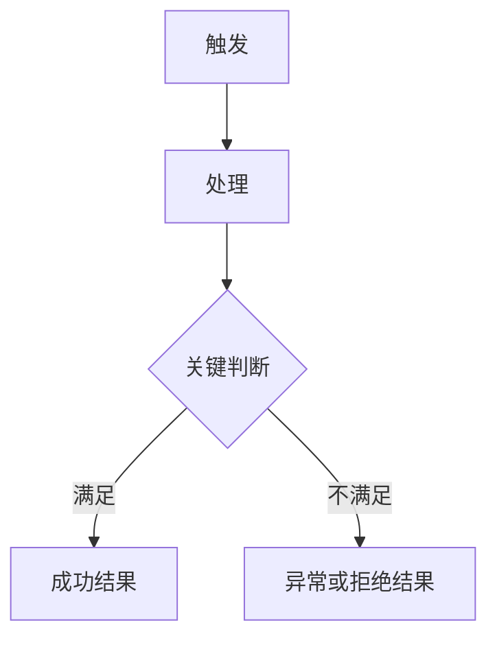

# <KEY> · <标题> Brief

## 1. 需求摘要

- **做什么**：<1–3 句话说明本次要解决的核心问题和交付能力>
- **为什么做**：<问题来源、业务动机或上游诉求>
- **用户价值**：<受影响用户、使用场景和最终获得的结果>
- **交付结果**：<可以据此判断需求完成的业务信号>
- **本次不做**：<明确排除的能力、兼容范围或后续事项>

## 2. 当前行为与问题

- **当前行为**：<基于真实代码和现有产品行为描述现状>
- **具体问题**：<现状为什么不能满足需求，会影响谁或什么流程>
- **事实依据**：<相关入口、模块、测试、文档或外部需求来源>

区分已核实事实、合理推断和待确认信息，不把目标方案写成当前能力。

## 3. 业务流程

### 3.1 主流程图

流程图只画主链路和关键异常分支，不把实现方法或所有细节塞进图里。

### 3.2 流程详解

1. **<节点名称>**
   - 触发者与动作：<谁在什么条件下做什么>
   - 系统行为与依赖：<系统承担的业务责任以及依赖对象>
   - 状态与数据：<状态如何变化、数据如何流转>
   - 可见结果：<用户或下游系统如何感知结果>

### 3.3 异常分支

| 异常分支 | 触发条件 | 系统行为 | 用户或下游感知 | 状态或数据结果 |
| --- | --- | --- | --- | --- |
|  |  |  |  |  |

## 4. 涉及模块与影响面

### 4.1 <模块或契约名称>

- **位置**：<真实目录、文件或系统层级>
- **职责**：<当前职责，以及本次承担的业务责任>
- **复用 / 新增**：<复用的现有能力，或需要新增的链路>
- **触碰的公共契约**：<API、共享类型、错误语义、权限、持久化、配置或部署；不涉及时写“不涉及”>
- **关键数据结构**：<关键实体、字段业务含义、必填性、归属与关系；不涉及时写“不涉及”>
- **可行性与不确定性**：<已核实的可行性、风险或仍需确认的事实>

涉及接口、表或其他对外数据契约变化时，补充字段级业务清单；精确长度、索引、约束、默认值、迁移顺序和代码方法留给技术设计。

| 对象 | 变更 | 字段 | 业务语义 | 必填性或归属 | 大致类型 |
| --- | --- | --- | --- | --- | --- |
|  | 新增 / 修改 / 删除 |  |  |  |  |

### 4.2 L2 最小实现思路（仅 L2）

<说明复用入口、新增链路、状态或数据流向和受影响契约，使开发者可直接进入实现。L3 删除本节，由 technical-design 承接。>

## 5. 风险与依赖

| 风险或依赖 | 触发条件 | 影响 | 当前判断或应对方向 |
| --- | --- | --- | --- |
|  |  |  |  |

## 6. 阻塞性决策（仅草稿阶段）

> 只记录会改变范围、行为、契约、数据、兼容或发布策略的真实选择。按依赖顺序逐项确认；结论回写正文后删除对应项。冻结前删除本节。

| 编号 | 分歧点 | 建议答案 | 为什么影响判断 | 影响范围 | 状态 |
| --- | --- | --- | --- | --- | --- |
| D1 |  |  |  |  | 待确认 |
