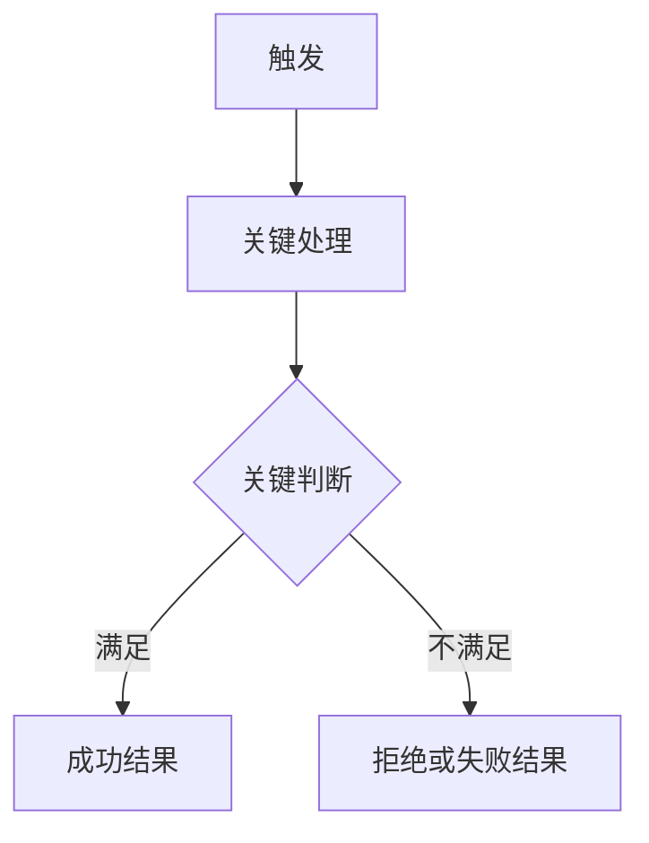
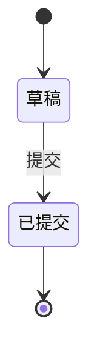
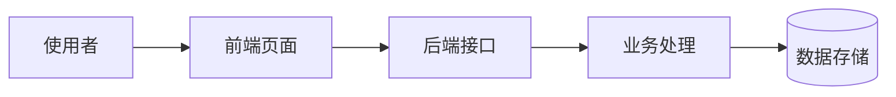
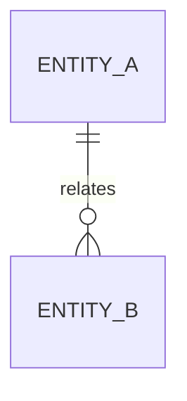

# <KEY> · <标题> 方案文档

| 项目 | 内容 |
| --- | --- |
| 任务标识 | <KEY；有 Issue 时可使用 Issue key，没有时使用 LOCAL-YYYYMMDD-SHORT-SLUG> |
| 一句话需求 | <一句话说明本次要交付什么> |
| 来源材料 | <当前请求、Issue 链接、飞书文档或用户指定材料；Issue 为可选追踪信息> |
| 复杂度 | <简单 / 中等 / 复杂；写主导原因> |
| 风险 | <常规 / 严格；严格时写具体触发项> |
| 记录 | <持久记录的原因> |
| 后续路径 | 契约验收 / 直接施工（确认方案时选定） |
| 创建时间 | <YYYY-MM-DD> |
| 最后更新 | <YYYY-MM-DD> |

> **模板使用说明（生成文档时删除）**
>
> - 本模板保留完整章节库，不是逐章填写的表单。生成方案时只保留核心章节和实际命中的条件章节。
> - 始终保留：`需求描述`、`现状与问题`、`业务流程`、`文件结构与实现方案`、`验证与验收`。
> - 高优先条件章节：涉及生命周期、状态字段、并发、重试或恢复时必须保留`状态机`；只要读写持久数据就必须保留`数据模型`。不得为了缩短文档而省略这两章。
> - 其他章节按其触发说明选择。未命中的章节整章删除，不写“无”“不涉及”或空表；删除后保留原章节编号，不需要重新编号。
> - 章节编号只帮助阅读，不是下游契约。提交用户确认前必须形成“可观察结果 → 业务规则 → 真实文件与编号步骤 → 验证证据”的完整对应。

## 第一部分 · 需求

第一部分只使用业务语言，不出现类名、方法名、表名、字段名、框架名和文件路径。

### 1. 需求描述

> 核心章节，始终保留。需求正文、可观察结果和本次不做不能删除。

#### 1.1 需求正文

<用完整段落讲清：谁在什么场景遇到什么问题；本次交付什么；交付后整件事如何运转；明确边界是什么。不要写“优化体验”“完善逻辑”之类无法验证的表述。>

#### 1.2 背景与动机（按需）

<当业务动机会影响范围、优先级、取舍或后续判断时保留。>

- **问题来源**：<用户反馈、业务目标、线上问题或上游要求>
- **为什么现在做**：<当前紧迫性或已经具备的前置条件>
- **不做会怎样**：<维持现状的具体影响>

#### 1.3 使用场景（按需）

<存在多个使用者、多个明显不同的使用时机，或场景会改变规则时保留。>

| 场景 | 使用者 | 触发时机 | 期望结果 |
| --- | --- | --- | --- |
|  |  |  |  |

#### 1.4 可观察结果

| 编号 | 完成后可以观察或断言的结果 |
| --- | --- |
| R1 |  |

#### 1.5 本次不做

- <明确排除的能力、兼容范围或后续事项，并说明排除原因>

### 2. 现状与问题

> 核心章节，始终保留。本章只写业务现状；真实代码证据放在“文件结构与实现方案”。

- **现在如何运作**：<基于已核实产品行为描述当前流程>
- **问题在哪里**：<现状为什么不能满足需求>
- **影响对象**：<受影响的使用者、业务流程或下游能力>
- **判断依据**：<当前请求、Issue、飞书文档、其他已确认材料或当前产品行为>

区分已核实事实、合理推断和待确认信息，不把目标方案写成当前能力。

### 3. 模块分解

> 普通按需章节。存在多个可以独立描述、独立验收或有明确依赖顺序的业务能力时保留；单一能力任务删除本章。

| 编号 | 业务模块 | 负责什么 | 明确不负责什么 | 依赖模块 | 完成信号 | 可否独立验收 |
| --- | --- | --- | --- | --- | --- | --- |
| M1 |  |  |  | 无 |  | 是 / 否 |

- **入口与触发**：<谁在什么场景进入该模块>
- **对外提供**：<向其他模块或外部提供的能力、数据或事件>
- **交付关系**：<依赖顺序、是否可独立上线；存在循环依赖时说明处理方式>

### 4. 业务流程

> 核心章节，始终保留一张表达主要链路的图。

#### 4.1 主要流程图



<单主体判断使用流程图；多方往返改用时序图；迁移或发布任务改画变更流程。同一条链路不要再画第二张重复图。>

#### 4.2 流程说明

<补充图中看不出的触发前提、关键校验、状态或数据变化、成功结果和失败中断点，不逐节点复述图。>

#### 4.3 关键规则与异常分支

| 编号 | 条件或动作 | 系统行为 | 用户或下游可见结果 | 失败后的状态或数据结果 |
| --- | --- | --- | --- | --- |
| BR1 |  |  |  |  |

### 5. 状态机

> 高优先条件章节。涉及对象生命周期、持久化状态、状态决定权限或操作、并发、重试、恢复时必须保留；真正不存在状态关系时删除整章。

#### 5.1 状态对象与边界

- **状态对象**：<这组状态描述什么对象或过程>
- **状态真值来源**：<状态保存在哪里或如何确定>
- **初始状态**：<创建时状态、创建者和进入条件>
- **终态**：<哪些状态不可再流出，以及允许的只读行为>

#### 5.2 状态关系图（按需）

<状态关系较多、只看表格难以理解时保留；简单状态只用流转表。>



#### 5.3 状态流转

| 起始状态 | 事件或条件 | 目标状态 | 触发者 | 重复或并发处理 | 副作用与可见结果 |
| --- | --- | --- | --- | --- | --- |
|  |  |  |  |  |  |

- **不允许的流转**：<非法操作如何拒绝，状态和数据是否保持不变>
- **超时、重试或恢复**：<触发条件、次数或期限、恢复结果和失败后状态>

## 第二部分 · 方案

第二部分必须基于真实仓库，可以并且应当使用真实文件、接口、字段、配置和技术名称。

### 6. 整体架构

> 普通按需章节。新增组件、改变职责边界、引入外部系统、跨系统协作或存在分阶段兼容时保留；局部改动删除本章。

#### 6.1 架构图（按需）



<只表达组件边界和上下游，不重复业务流程图。>

#### 6.2 分层与职责

| 组件或层次 | 当前事实与证据 | 本次承担什么 | 明确不承担什么 | 上下游或消费方 |
| --- | --- | --- | --- | --- |
|  | `<真实文件、配置或接口>` |  |  |  |

#### 6.3 关键数据流（按需）

<只有多组件交互顺序、数据转换或失败中断会影响实现时保留；如果主要流程图已经是同一条时序则删除本节。>

#### 6.4 技术选型与取舍（按需）

| 决策点 | 选定方案 | 放弃的方案 | 理由与代价 |
| --- | --- | --- | --- |
|  |  |  |  |

### 7. 数据模型

> 高优先条件章节。只要读取或写入持久数据就必须保留；完全不读写持久数据时才删除整章。

#### 7.1 数据影响与真值源

| 数据对象 | 变更层级 | 读取方 | 写入方 | 归属与权限 | 必须保持的不变量 |
| --- | --- | --- | --- | --- | --- |
|  | 仅使用现有数据 / 修改结构 / 数据迁移 |  |  |  |  |

- **模型定义现状**：<真实 ORM 或模型事实；不改结构时也要核对>
- **仓库迁移 head**：<修改结构或迁移数据时填写>
- **目标环境 current revision**：<已核实值；无法核实时明确写“尚未核实”>

<只使用现有数据且不修改结构时，填写本节后删除 7.2 至 7.5。新增或修改表、字段、约束、索引、枚举，或者需要回填、迁移、改变归属和清理规则时，继续完整填写后续内容。>

#### 7.2 实体关系（按需）

<存在多个实体或关联发生变化时保留；单个简单实体可以删除关系图。>



#### 7.3 物理定义

| 表或实体 | 变更 | 用途 | 归属与权限 | 数据量与主要查询 |
| --- | --- | --- | --- | --- |
|  | 新增 / 修改 / 删除 |  |  |  |

| 字段 | 类型 | 可空 | 默认值 | 业务含义 | 变更 | 约束、索引或枚举 |
| --- | --- | --- | --- | --- | --- | --- |
|  |  |  |  |  | 新增 / 修改 / 删除 / 不变 |  |

- **主键**：<字段和生成策略>
- **唯一约束**：<约束名、字段组合和业务含义>
- **索引**：<索引名、字段顺序和支撑的查询>
- **外键与关联策略**：<约束名、关联对象、删除和更新行为>
- **枚举取值**：<字段、合法取值及其与状态机的对应关系>

#### 7.4 定稿 DDL

```sql
-- 设计定稿，仅供评审和实现阶段引用，本阶段不执行
```

#### 7.5 存量数据、兼容与迁移

- **存量数据处理**：<回填、清洗、默认值或保持不变>
- **兼容与发布顺序**：<迁移、代码切换和消费方更新的先后>
- **数据回退**：<失败时已写入的新数据如何处理>
- **不可逆点**：<哪一步之后无法恢复，以及接受条件>

### 8. 接口契约

> 条件必选章节。新增或修改 HTTP、事件、共享类型、配置键、文件格式或其他公共契约时必须保留。

| 契约 | 变更 | 输入或请求 | 输出或响应 | 错误与失败语义 | 权限 | 消费方 | 兼容方式 |
| --- | --- | --- | --- | --- | --- | --- | --- |
| `POST /api/example` / 事件、配置或格式名 | 新增 / 修改 / 删除 |  |  |  |  |  |  |

- **HTTP 方法与路径**：<HTTP 契约必须同时写 METHOD 和 PATH>
- **共享类型或配置影响**：<需要同步的类型、配置或格式定义>

### 9. 文件结构与实现方案

> 核心章节，始终保留。这是代码生成的直接施工依据，必须基于真实仓库。

#### 9.1 目录树（按需）

<新增、移动、删除多个文件，或目录关系本身影响理解时保留。>

```text
<repository>/
└── <path>  # [新增/修改/删除] <一句话目的>
```

#### 9.2 文件职责（按需）

<文件较多、职责变化复杂或需要先做影响盘点时保留；简单任务可以直接进入代码实施计划。>

| 文件或模块 | 当前事实与证据 | 动作 | 修改后职责 | 依赖或消费方 |
| --- | --- | --- | --- | --- |
| `<真实路径>` |  | 新增 / 修改 / 删除 |  |  |

#### 9.3 代码实施计划

<核心子节，始终保留。每行只做一件事，按真实依赖排序。>

| 步骤 | 对应结果或规则 | 真实路径 | 动作 | 修改后职责或具体行为 | 依赖或消费方 | 完成判据 |
| --- | --- | --- | --- | --- | --- | --- |
| 1 | R1 / BR1 | `<真实文件路径>` | 新增 / 修改 / 删除 |  | 无 |  |

#### 9.4 实现要点与复用能力（按需）

- **实现要点**：<真正影响代码生成的算法、事务、并发、幂等、性能、失败副作用或易踩问题；引用步骤编号>
- **复用能力**：<已核实可以复用的现有实现及真实路径>

### 10. 外部服务与安全边界

> 条件必选章节。涉及外部服务、鉴权、资源归属、敏感数据、密钥、限流、重试或日志安全时必须保留。

| 边界 | 方案 | 失败结果 | 验证方式 |
| --- | --- | --- | --- |
| 身份与资源归属 |  |  |  |
| 发送数据与脱敏 |  |  |  |
| 密钥与配置 |  |  |  |
| 超时、重试、幂等与取消 |  |  |  |
| 日志与监控禁区 |  |  |  |

## 第三部分 · 收口

### 11. 实施顺序

> 普通按需章节。只用于跨模块、多阶段、迁移、兼容窗口或生产发布顺序；普通文件修改顺序已经写在代码实施计划中，不重复一遍。

| 阶段 | 进入条件 | 动作 | 涉及模块或文件 | 观察与完成信号 | 失败处理 |
| --- | --- | --- | --- | --- | --- |
| 1 |  |  |  |  |  |

#### 11.1 发布、回退与不可逆点（按需）

1. <发布或迁移步骤及进入条件>
2. <观察指标或成功信号>
3. <失败后的应用和数据回退顺序>
4. <不可逆步骤及执行前提>

### 12. 已确认决策

> 普通按需章节。只记录真实发生且值得追溯的业务或技术选择，不复制正文。

| 编号 | 决定事项 | 结论 | 放弃的方案 | 理由与代价 | 确认来源 |
| --- | --- | --- | --- | --- | --- |
| D1 |  |  |  |  | 当前请求 / 用户确认 / 飞书详情文档 / 来源 Issue |

### 13. 风险与依赖

> 条件按需章节。存在严格风险、外部依赖、已接受限制或尚需重点观察的事项时保留。

| 风险或依赖 | 触发条件 | 影响 | 预防、降级或回退 | 验证或责任方 |
| --- | --- | --- | --- | --- |
|  |  |  |  |  |

### 14. 验证与验收

> 核心章节，始终保留。直接施工路径以本章作为验证契约；契约验收路径由 Acceptance 基于同一批结果和规则展开场景。

| 编号 | 可观察结果或规则 | 验证层级 | 测试文件或命令 | 关键断言或人工步骤 | 预期证据 |
| --- | --- | --- | --- | --- | --- |
| V1 | R1 / BR1 | 单元 / 组件 / 集成 / 迁移 / 人工 | `<真实测试路径或命令>` |  |  |
