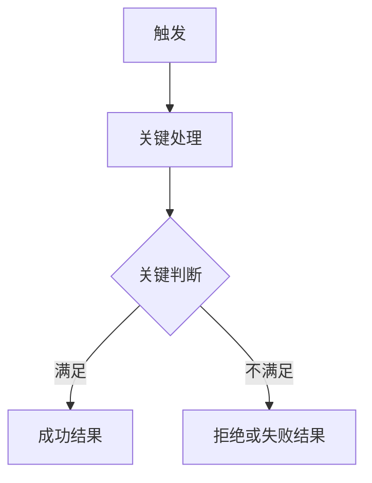
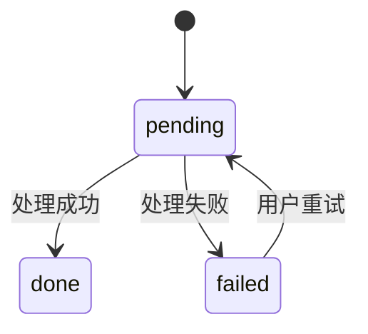

# <KEY> · <标题>

> <一句话：谁，在什么场景，得到什么结果。>

- **任务标识**：<KEY；有 Issue 用 Issue key，没有时用 LOCAL-YYYYMMDD-SHORT-SLUG>
- **来源**：<当前请求 / Issue 链接 / 用户指定的外部材料>
- **后续路径**：直接施工 / 契约验收（确认方案时选定）
- **更新时间**：<YYYY-MM-DD>

> **模板使用说明（生成文档时删除本段）**
>
> - 第一部分写给开发者，是本文档的核心：讲清需求、拆分、难点和待确认问题，只用业务语言。
> - 第二部分只写必须说清楚的硬约束：数据库变更、接口与数据结构、中间件与外部依赖、状态机。未命中的小节整节删除，不写“无”“不涉及”。
> - 第三部分交给实施 Agent：只写影响范围、粗粒度施工顺序和验证映射，具体写法由 Agent 按真实代码决定。
> - 主线是“可观察结果 → 业务规则 → 实施步骤 → 验证证据”，每个 R 都必须在后两部分找到承接。
> - 少用宽表格：超过 4 列的信息改成分条列表；每节先写结论，再写细节。

## 第一部分 · 需求理解

本部分不出现类名、方法名、表名、字段名、框架名和文件路径。不看代码的人读完应能复述：要做什么、拆成几块、难在哪、还有什么没定。

### 1. 需求概述

<两到四段短文：谁在什么场景遇到什么问题；本次交付什么；交付后整件事怎么运转。避免“优化体验”“完善逻辑”这类无法验证的说法。>

**现在的情况**：<当前产品如何运作、问题在哪、影响谁。只写已核实事实，计划不写成现状。>

**为什么现在做**（按需）：<业务动机会影响范围或取舍时才写。>

### 2. 需求拆分

<把需求拆成可以独立理解和验收的子需求。单一能力就只有一组 R，不硬拆模块。>

#### 2.1 <子需求名称>

<一两句说明这一块做什么、谁触发、依赖哪一块。>

- **R1**：<完成后可以观察或断言的结果>
- **R2**：<……>

#### 2.2 <子需求名称>

- **R3**：<……>

**本次不做**：

- <排除项>：<排除原因，避免实现者当作遗漏补回>

### 3. 业务流程与规则


```mermaid
flowchart TD
    A["触发"] --> B["关键处理"]
    B --> C{"关键判断"}
    C -->|满足| D["成功结果"]
    C -->|不满足| E["拒绝或失败结果"]
```

<只补充图里看不出的前提、数据变化和失败中断点，不逐节点复述。多方往返用 sequenceDiagram，迁移或发布任务画变更顺序。>

**关键规则**：

- **BR1**：<条件或动作> → <系统行为>；<用户或下游看到什么>；失败时 <数据保持什么状态>
- **BR2**：<……>

### 4. 难点与风险

<只写真正难、容易做错或代价高的点。每条讲清楚难在哪和打算怎么应对，不写泛泛的“注意性能”。>

- **难点一：<一句话标题>**
  - 难在哪：<具体原因，例如并发重复、数据量、外部服务不稳定、旧数据形态复杂>
  - 不处理会怎样：<可观察的后果>
  - 应对思路：<方向性结论；细节留给实施>

### 5. 待确认问题

<影响范围、业务规则、数据归属、权限、兼容、成本或不可逆结果，而且无法从代码和材料中核实的问题。按依赖顺序排列，一次确认一个。确认后从本节移到“已确认决策”，本节清空后整节删除。>

- **Q1：<问题>**
  - 背景：<已核实的事实>
  - 选项：A <……>；B <……>
  - 推荐：<A>，因为 <理由>
  - 影响：选 A 会 <……>；选 B 会 <……>

### 6. 已确认决策

<只记录真实发生、值得追溯的选择；没有时删除本节。>

- **D1：<决定事项>** —— <结论>。放弃 <方案>，因为 <理由与代价>。来源：<当前请求 / 用户确认 / 来源 Issue>

## 第二部分 · 设计约束

本部分使用真实表名、字段、接口和配置。只写实现前必须定死、改错代价高的内容；普通代码组织不写。

### 7. 数据库变更

<只要读写持久数据就保留本节；完全不碰持久数据时删除。新表与新增字段必须遵守 mysql-ddl-conventions 中的阿里巴巴 MySQL 规约；修改存量表时沿用该表已有命名，冲突处在“规约自检”里标为存量例外。>

#### 7.1 数据影响

<按数据对象用短段落说明：谁读、谁写、归属哪个用户、必须保持的不变量。只读写现有数据且不改结构时，写完本小节即可删除 7.2 至 7.4。>

- **模型定义现状**：<真实 ORM 文件与表>
- **仓库迁移 head**：<修改结构时填写>
- **目标环境 current revision**：<已核实值；无法核实写“尚未核实”>

#### 7.2 数据结构变更

<按表组织。结构片段只供评审，不是可执行 DDL，不写 CREATE TABLE、ALTER TABLE、INSERT、UPDATE、DELETE 完整语句。>

##### `<表名>`（新增表 / 修改已有表 / 删除表）

用途：<这张表保存什么、一行代表什么、预计数据量级>

字段：

```sql
id           bigint unsigned not null auto_increment comment '主键'
user_id      bigint unsigned not null comment '所属用户 ID，应用层校验归属'
<field_name> varchar(64)     not null default '' comment '<字段含义与取值说明>'
is_<flag>    tinyint unsigned not null default 0 comment '<含义>：1 是，0 否'
create_time  datetime(6)     not null default current_timestamp(6) comment '创建时间'
update_time  datetime(6)     not null default current_timestamp(6) comment '更新时间'
```

约束与索引：

```sql
pk  (id)
uk_<表名>_<字段> (<字段>)          -- <对应的业务唯一规则>
idx_<表名>_<字段> (<字段1>, <字段2>)  -- <支撑的真实查询：条件 + 排序>
```

关联与完整性：<关联到哪些表、由哪一层保证存在性和删除清理；新表不建数据库外键与级联。>

#### 7.3 存量数据与迁移（按需）

<只在存在回填、清理、兼容窗口、发布顺序、数据回退或不可逆点时保留。用正常文本描述，不写可执行 SQL。>

- **存量处理**：<范围、回填规则、异常数据怎么办、是否幂等>
- **发布顺序**：<迁移、后端、前端或插件的先后>
- **回退与不可逆点**：<哪一步之后只能靠备份恢复>

#### 7.4 规约自检

<逐条核对本次新增或修改的结构。全部符合时写一句“已按规约逐项核对，无例外”；有存量例外或经确认的偏离时逐条列出。>

- <例外项>：<违反哪条规约> —— <原因：存量表沿用 / 用户确认的偏离>

### 8. 接口与数据结构

<新增或修改 HTTP 接口、共享类型、事件、消息体、JSON 字段结构、文件格式或配置键时保留。>

#### `<METHOD> <PATH>`（新增 / 修改 / 删除）

- **权限**：<谁可以调用，归属在哪里校验，越权返回什么>
- **请求**：<关键字段与校验规则>
- **响应**：<关键字段；ID 在 HTTP 与 TypeScript 中的表示>
- **错误**：<状态码 + 错误码 + 触发条件>
- **消费方与兼容**：<Web / Extension / 小程序；旧客户端如何继续工作>

<JSON 字段、消息体或缓存值的结构用 TypeScript 或 JSON 示例写清，并说明版本与兼容方式。>

### 9. 中间件与外部依赖

<用到 Redis、RabbitMQ、MinIO、LLM、第三方服务或新依赖时保留。每项都写清楚用途和失败表现；只复用已有能力且不新增 key、队列、路径或配置时一句话带过。>

- **<Redis / RabbitMQ / MinIO / LLM 场景 / 第三方服务 / 新依赖包>**
  - 用途：<为什么需要它>
  - 新增或变化：<key 格式与 TTL / 队列与消息体 / 对象路径 / 模型场景 / 包名与版本>
  - 配置：<新增环境变量和默认值，需要同步的 Compose 与部署入口>
  - 失败与降级：<超时、重试、幂等，以及用户看到什么>
  - 安全：<发送了哪些数据、脱敏、密钥位置、日志禁区>

### 10. 状态机

<涉及对象生命周期、状态决定权限或可执行操作、并发、重试或恢复时保留；单个布尔判断不需要状态机。>

- **状态对象与真值来源**：<哪个对象的状态，保存在哪里>
- **初始状态 / 终态**：<……>


```mermaid
stateDiagram-v2
    [*] --> pending
    pending --> done: 处理成功
    pending --> failed: 处理失败
    failed --> pending: 用户重试
```

- **<起始> → <目标>**：<触发者>；<重复或并发如何处理>；<副作用与可见结果>
- **非法流转**：<如何拒绝，数据保持不变>
- **超时、重试与恢复**：<触发条件、上限、失败后状态>

## 第三部分 · 实施与验证

本部分交给实施 Agent。具体文件拆分、函数设计和代码写法由 Agent 依据真实仓库决定，这里只固定范围、顺序和验证标准。

### 11. 影响范围

<列出已核实会被改动的模块和直接消费方，每项一行，给真实路径。>

- `<真实路径>`：<改什么>

### 12. 代码实施计划

<按依赖顺序写粗粒度步骤，每步对应一个可以独立完成和验证的单元，并引用承接的 R 或 BR。不逐文件、逐函数展开。>

1. <步骤>（R1、BR1）：<完成判据>
2. <步骤>（R2）：<完成判据>

**实现要点**（按需）：<只写真正影响正确性的事务、并发、幂等或性能约束，引用步骤编号。>

### 13. 验证与验收

<每个 R 和决定行为的 BR 至少对应一项验证。直接施工路径以本节为唯一验证契约。>

- **V1**（R1、BR1）：<单元 / 集成 / 迁移 / 人工> —— `<真实测试文件或命令>`；断言 <关键结果>
- **V2**（R2）：人工 —— 在 <环境> 执行 <动作>，看到 <结果>
