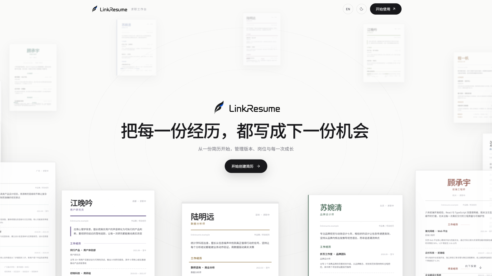
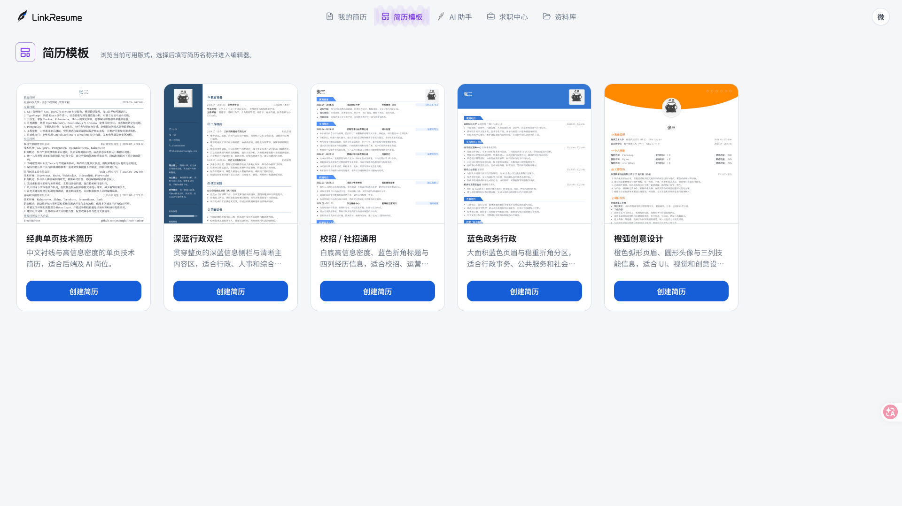
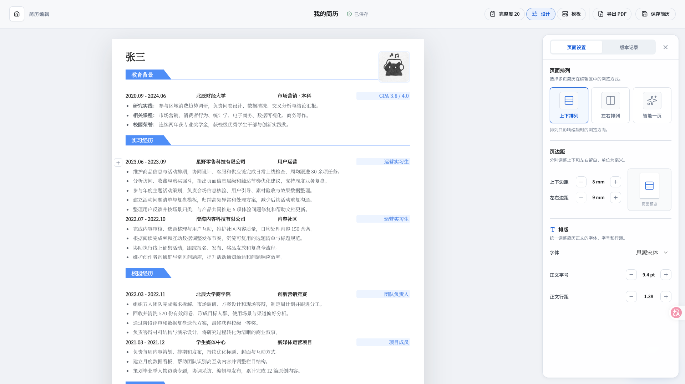
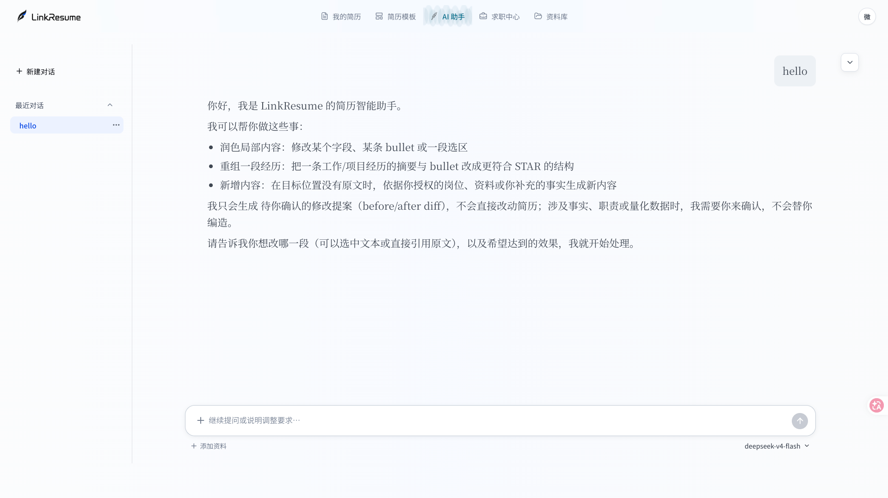
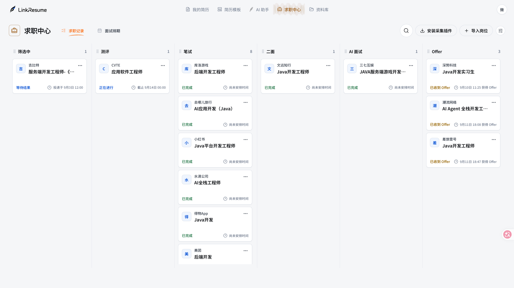

# LinkResume

> 面向中文求职者的一站式 AI 求职工具。

LinkResume 将简历制作、岗位管理、投递跟踪和面试复盘放进同一个工作区，帮助求职者减少在 Word、招聘网站、表格和聊天记录之间反复切换。



## 为什么做 LinkResume

一段完整的求职经历通常会产生多份简历、多个岗位链接、不同投递版本以及大量面试记录。这些内容往往散落在不同工具里，既难以整理，也很难回顾每一次修改和投递。

LinkResume 希望以简历为起点，把岗位、投递、面试和个人资料连接起来，让求职过程更清晰，也让 AI 能够在用户明确选择的上下文中提供更具体的建议。

## 主要功能

| 功能 | 说明 |
| --- | --- |
| 简历制作 | 从模板或已有的 Markdown、DOCX、PDF 文件开始，在线编辑并自动保存 |
| 版本与导出 | 为不同岗位保存简历版本，支持恢复、分享和 PDF 导出 |
| AI 求职助手 | 结合用户选择的简历、岗位和资料进行分析，生成需要用户确认的修改建议 |
| 岗位与投递管理 | 导入岗位信息，通过看板记录投递阶段和求职进展 |
| 面试安排与复盘 | 使用日历管理笔试、测评和面试，并保存面试记录与复盘 |
| 个人资料集 | 分类保存求职材料，在需要时作为 AI 助手的上下文引用 |

## 界面预览

### 简历模板

从不同版式的简历模板开始创建，根据岗位和内容选择合适的呈现方式。



### 简历编辑

在接近真实 A4 纸张的工作区中编辑简历，调整页面设置、切换模板、管理版本并导出 PDF。



### AI 求职助手

主动选择简历、岗位或个人资料作为上下文，向 AI 发起分析和优化请求。涉及简历内容的修改不会自动覆盖原文，需要用户确认后才会应用。



### 求职进程

把岗位和投递进度集中到看板中，查看每个机会当前所处的阶段。



## 如何使用

1. 注册或登录 LinkResume。
2. 从模板创建简历，或者导入已有的 Markdown、DOCX、PDF 文件。
3. 在编辑器中完善内容，根据需要保存版本并导出 PDF。
4. 导入目标岗位，在求职看板中记录投递进度。
5. 添加笔试或面试安排，并在结束后记录复盘。
6. 需要分析或优化时，在 AI 助手中主动选择相关简历、岗位和资料。

## 本地运行

### 环境要求

- Node.js 22 LTS 与 npm 10+
- Python 3.11–3.13 与 [uv](https://docs.astral.sh/uv/)
- Docker 与 Docker Compose

### 初始化

```bash
cp .env.example .env
npm run setup
npm run infra:up
npm run db:init
npm run dev:local
```

启动后访问 `http://127.0.0.1:5173`。本地环境默认同时运行 Web、FastAPI、文档解析 Worker 和 Pi Agent；MySQL、Redis、MinIO 与 RabbitMQ 由 Docker Compose 提供。

PDF、DOCX 解析和真实 AI 能力依赖额外的服务及模型配置。缺少这些配置时，基础页面和非 AI 功能仍可用于本地开发，详细配置见[本地开发文档](docs/ops/development.md)。

### 常用命令

| 命令 | 作用 |
| --- | --- |
| `npm run dev:local` | 使用本地中间件启动开发环境 |
| `npm run dev:development` | 使用共享 Development 中间件启动本地应用 |
| `npm run build` | 构建 Web、Chrome 插件和后端包 |
| `npm test` | 运行各应用自动化测试 |
| `npm run check` | 运行完整本地质量检查 |

## 技术架构

LinkResume 是 React/TypeScript 与 FastAPI 构成的前后端分离 Monorepo。Web 请求通过 Vite 或部署网关访问 FastAPI，业务数据保存在 MySQL，私有文件保存在 MinIO，Redis 用于会话与运行时状态，RabbitMQ 用于异步文档解析。

```text
apps/web         React、TypeScript、Vite Web 应用
apps/extension   WXT、React、TypeScript Chrome 岗位采集插件
apps/miniprogram 微信小程序
apps/backend     FastAPI、SQLAlchemy、Alembic 后端与 Worker
apps/pi-service  AI Agent 服务
deploy           Docker Compose 与部署配置
docs             架构、功能、API 与运维文档
```

更完整的项目说明可以从[文档索引](docs/README.md)进入：

- [简历与工作台](docs/features/resume-workbench.md)
- [求职中心](docs/features/career-center.md)
- [AI 求职助手](docs/features/ai-assistant.md)
- [用户资料集](docs/features/datasets.md)
- [整体架构](docs/internals/architecture.md)

## 浏览器岗位采集插件

项目包含可侧载的 Chrome Manifest V3 插件。插件只读取用户当前打开的 BOSS 直聘岗位详情，在用户核对并确认后导入 LinkResume，不执行自动投递、后台批量抓取或轮询。构建与安装步骤见[插件说明](apps/extension/README.md)。
