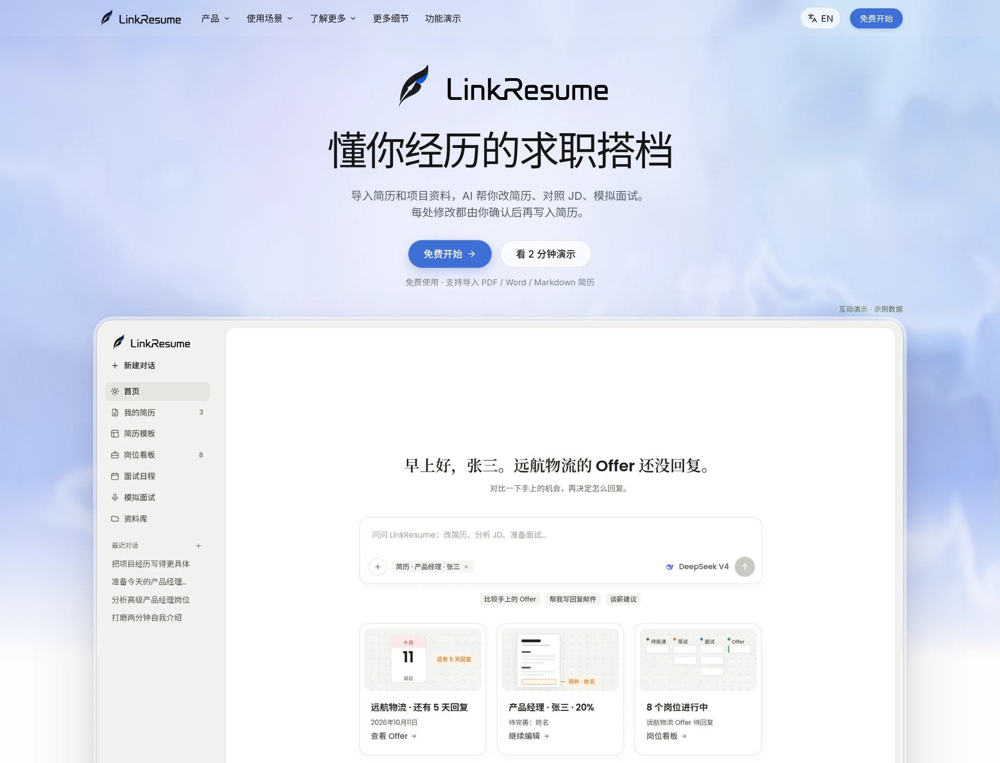
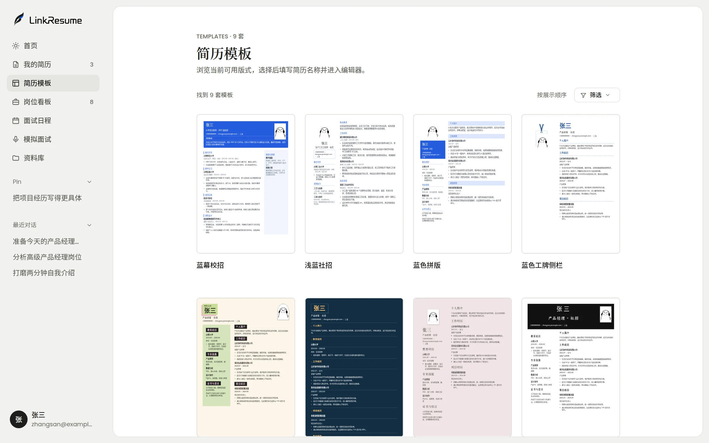
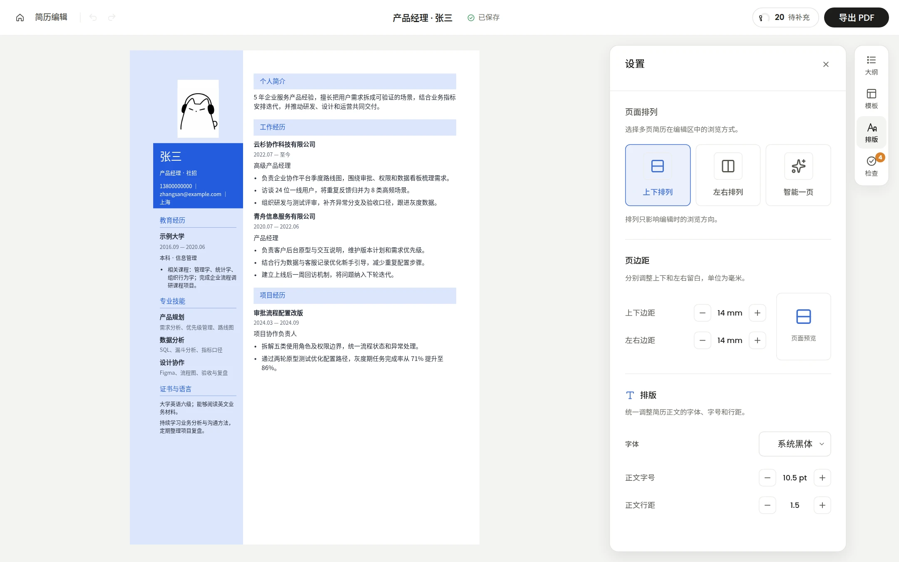
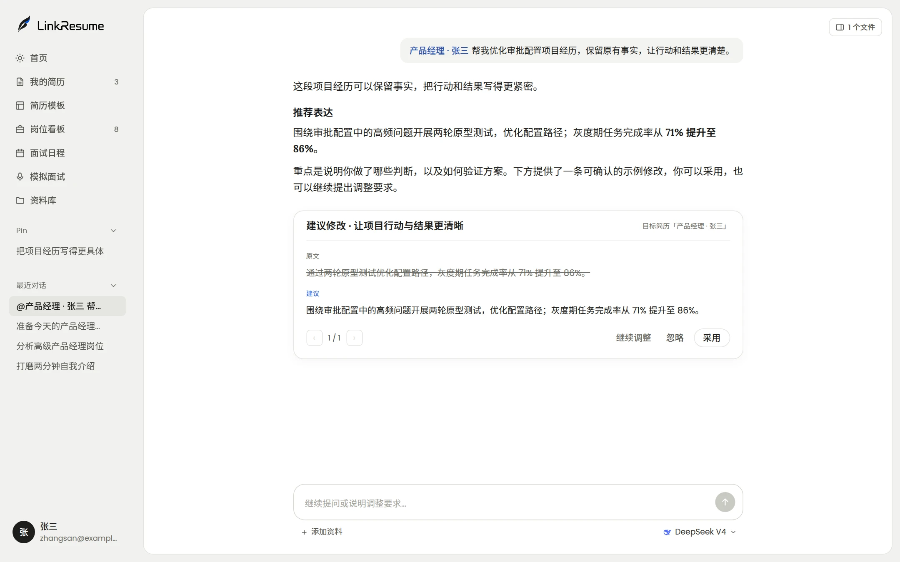
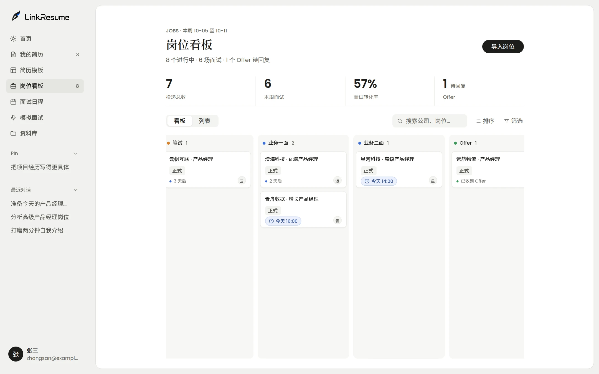
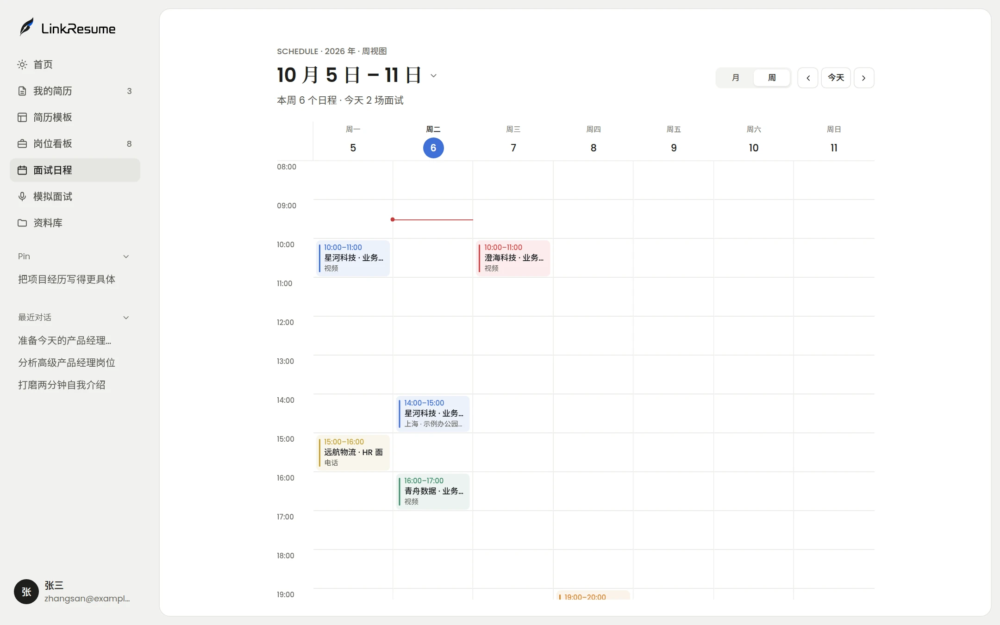
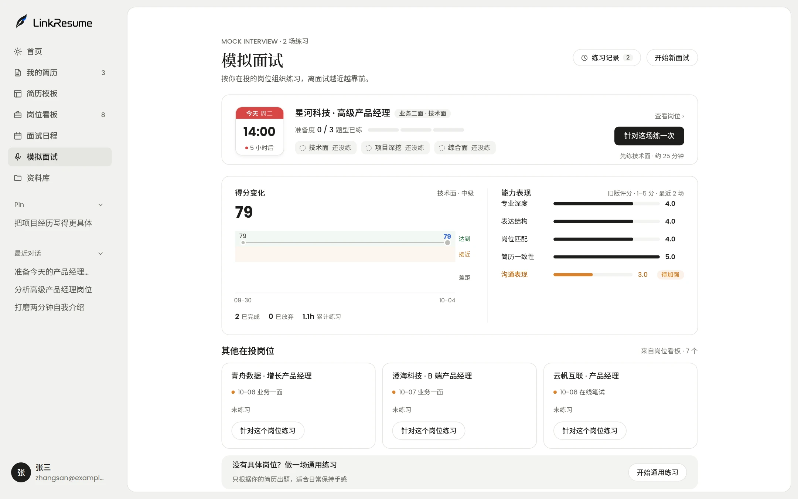
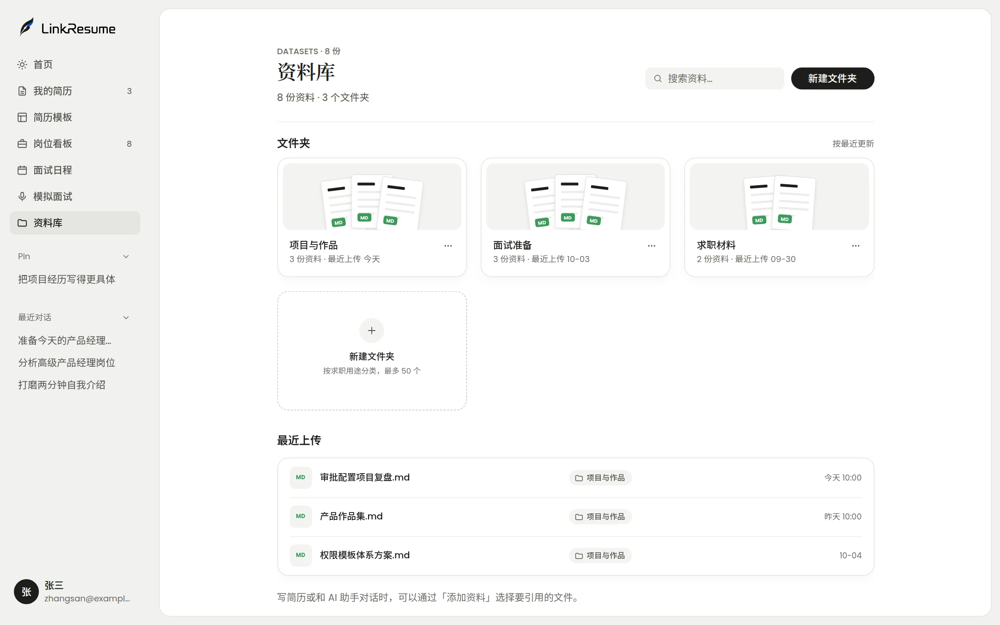

# LinkResume

> 懂你经历的求职搭档。

LinkResume 是面向中文求职者的 AI 求职工作台。从导入简历和项目资料开始，用 AI 梳理经历、对照岗位要求、练习面试，再把简历、岗位和求职进度放在同一个工作区里管理。

[在线体验](https://linkresume.cn/resumes) · [官网](https://linkresume.cn/home) · [界面预览](#界面预览) · [本地运行](#本地运行) · [项目文档](docs/README.md)

[](https://linkresume.cn/home)

## 从经历到机会

求职准备不止是写完一份简历。面对不同岗位，你需要挑选相关经历、调整表达、跟进投递，还要准备项目追问和整理面试反馈。这些材料如果散落在文档、招聘网站、表格和聊天记录里，每一步都要重新找信息。

LinkResume 把这条路径连接起来：简历保存你的经历，岗位明确目标，资料库补充细节，AI 助手围绕你选择的内容展开分析，岗位看板和日程记录接下来的行动。简历修改先展示前后对比，由你确认后再写入。

## 可以做什么

| 能力 | 使用方式 |
| --- | --- |
| 制作与整理简历 | 从模板新建，或导入 PDF、DOCX、Markdown；在 A4 画布中编辑，自动保存，按不同岗位复制独立简历 |
| 排版、分享与导出 | 切换模板，调整字体、行距和页边距，选择 A4 分页或智能一页，生成分享链接与 PDF |
| AI 简历助手 | 引用简历、岗位和资料，诊断表达、梳理项目、分析 JD 或准备面试；逐项查看并确认修改提案 |
| 岗位与求职进程 | 导入岗位，关联简历，在看板中跟进投递、筛选、面试和 Offer |
| 面试日程与记录 | 用日历安排笔试和面试，保存准备清单、面试材料与复盘笔记 |
| AI 模拟面试 | 基于简历与岗位进行文字或语音练习，接受追问，结束后查看逐题反馈和评估报告 |
| 个人资料库 | 按文件夹整理项目文档、作品和求职材料，在 AI 对话或模拟面试中主动选择引用 |
| 浏览器岗位采集 | 在 Chrome 中读取当前 BOSS 直聘岗位，核对后导入工作区 |

## 界面预览

以下截图使用当前 Web 页面组件与虚构数据生成。AI 回复与评分均为演示示例，不代表真实模型调用或实际求职结果。

### 简历模板：选择适合内容的版式

浏览模板预览，按视觉风格与实习、校招、社招等场景筛选。从模板开始创建，也可以在编辑时切换版式。

[](https://linkresume.cn/templates)

### 简历编辑：内容与排版一起完成

在 A4 画布中直接编辑正文，调整模块顺序、字体、字号、行距和页边距。内容自动保存，完成后可以导出 PDF，或复制一份用于另一个目标岗位。

[](https://linkresume.cn/resumes)

### AI 助手：看清建议，再决定如何修改

把选中的简历、岗位和项目资料带入对话，让助手协助梳理经历、分析 JD 或准备面试。修改建议展示原文与建议内容，可以应用、继续调整或放弃。

[](https://linkresume.cn/assistant)

### 岗位看板：跟进每一个机会

把岗位、关联简历和当前求职阶段放在同一张看板中，查看待投递、已投递、面试和 Offer，继续记录每个机会的进展。

[](https://linkresume.cn/career/applications)

### 面试日程：把准备落实到时间

集中查看笔试与面试安排，通过月历、周历和场次详情管理时间与准备事项。

[](https://linkresume.cn/career/schedule)

### 模拟面试：围绕真实经历练习

选择简历与目标岗位，设置面试类型、难度和语言，以文字或语音作答。AI 面试官根据回答追问，结束后提供逐题反馈和后续练习建议。

[](https://linkresume.cn/mock-interviews)

### 资料库：让项目细节随手可用

把项目复盘、作品集和面试材料按文件夹整理。需要分析或练习时，主动选择相关资料作为上下文。

[](https://linkresume.cn/datasets)

## 开始使用

1. 打开[在线工作区](https://linkresume.cn/resumes)，通过微信小程序扫码登录。
2. 导入已有简历，或选择模板创建一份；完善内容并导出 PDF。
3. 收集目标岗位，关联对应简历，在看板里跟进求职进度。
4. 将项目文档和作品放进资料库，在 AI 助手中选择相关内容进行分析和修改。
5. 安排面试，进行模拟练习，结束后整理记录与反馈。

线上普通用户使用微信扫码登录；本地与 Development 环境使用邮箱注册和密码登录。可用模型和语音能力以实际环境配置为准。

## 本地运行

### 环境要求

- Node.js 22 LTS 与 npm 10+
- Python 3.11–3.13 与 [uv](https://docs.astral.sh/uv/)
- Docker 与 Docker Compose

### 初始化与启动

```bash
cp .env.example .env
npm run setup
npm run infra:up
npm run db:init
npm run dev:local
```

启动后访问 [http://127.0.0.1:5173](http://127.0.0.1:5173)。`dev:local` 使用本地中间件，同时启动 Web、PDF 渲染构建监听、FastAPI、文档解析 Worker 和 Pi Agent；MySQL、Redis、MinIO 与 RabbitMQ 由 Docker Compose 提供。

文件解析、AI 对话和语音能力需要相应的外部服务与模型配置，配置步骤见[本地开发文档](docs/ops/development.md)。

### 常用命令

| 命令 | 作用 |
| --- | --- |
| `npm run dev:local` | 使用本地中间件启动开发环境 |
| `npm run dev:development` | 使用共享 Dev 中间件启动本地应用，需先配置对应环境文件 |
| `npm run typecheck:web` | 检查 Web TypeScript 类型 |
| `npm run test:web -- <测试文件>` | 运行指定 Web 测试 |
| `npm run check:docs` | 检查长期文档同步 |
| `npm run check:contracts` | 检查确定性运行时契约 |

## 项目结构

Web 使用 React、TypeScript 与 Vite，业务 API 使用 FastAPI。MySQL 保存业务数据，MinIO 保存私有文件，Redis 管理会话与运行时状态，RabbitMQ 调度异步文档解析。独立的 Pi Agent 服务通过受控工具调用后端。

```text
apps/web         Web 工作区、公共官网与分享页
apps/extension   Chrome / Edge 求职助手插件（岗位采集与网申填写）
apps/miniprogram 微信小程序与扫码登录入口
apps/desktop     Electron 桌面壳
apps/mac         macOS 原生客户端
apps/windows     Windows 原生客户端
apps/native      原生客户端共用资源与简历渲染工具
apps/backend     FastAPI、Worker 与 SQL-first Alembic 迁移
apps/pi-service  Pi Agent 服务
third_party/pi   项目引入的 Pi 工具包
deploy           Docker Compose 与部署配置
docs             功能、架构、API 与运维文档
```

各客户端的能力范围以对应文档为准。完整资料从[文档索引](docs/README.md)进入：

- [简历与工作台](docs/features/resume-workbench.md)
- [AI 求职助手](docs/features/ai-assistant.md)
- [岗位、求职进程与面试日程](docs/features/career-center.md)
- [AI 模拟面试](docs/features/mock-interview.md)
- [个人资料库](docs/features/datasets.md)
- [浏览器插件安装与开发](apps/extension/README.md)
- [网申填写插件安装与开发](apps/extension/README.md)
- [原生客户端](apps/native/README.md)
- [整体架构](docs/internals/architecture.md)
- [本地开发](docs/ops/development.md)与[部署说明](docs/ops/deployment.md)

展示图片可通过[截图脚本](apps/web/scripts/capture-readme.mjs)重新生成，使用独立演示入口，无需真实账号或后端服务。

## 浏览器岗位采集插件

插件读取用户当前打开的 BOSS 直聘岗位详情，先展示预览，核对并确认后才导入 LinkResume。安装入口位于工作区岗位看板，侧载与开发步骤见[插件说明](apps/extension/README.md)。

插件不执行自动投递、后台批量抓取或轮询。
